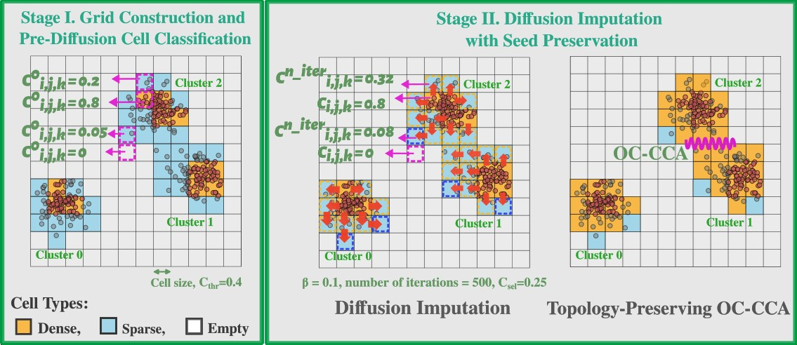

# ClusTEK

**ClusTEK** is a grid-based clustering toolkit that combines grid aggregation, diffusion-based imputation, and topology-preserving connected-component analysis.


While motivated by molecular simulation data, the method is applicable to a wide range of spatially structured datasets.


---

## Method Overview



ClusTEK consists of two main stages, with Stage II introducing the diffusion-imputation and topology-preserving clustering framework:

### **Stage I — Grid construction and pre-diffusion classification**
- Discretize space into a structured grid
- Compute a scalar field \( C^{(0)}_{i,j,k} \) (e.g., counts or averaged attributes)
- Classify cells into:
  - dense
  - sparse
  - empty  
  using a threshold \( C_{\mathrm{thr}} \)

### **Stage II — Diffusion imputation and clustering**
- Apply **finite, local diffusion** to propagate information from dense to neighboring sparse cells 
- Dense cells are **clamped** (Dirichlet constraint)
- Sparse cells are updated iteratively to obtain \( C^{(n)} \)
- Perform **origin-constrained connected-component analysis (OC-CCA)**:
  - seeded from original dense cells
  - prevents artificial merging of distinct clusters

---


## Install

From the repository root:

```bash
pip install -e .
```
> If the CLI command is not found after installation, ensure your Python environment is activated and that the editable install completed successfully.
 
This installs the core ClusTEK package and its dependencies.

To install additional tools needed for development (testing, linting, benchmarks), use:

```bash
pip install -e ".[dev]"
```

> Requirements are intentionally limited to standard scientific Python packages.  
> Optional 3D post-processing features (e.g., alpha-shape surface reconstruction)  
> may be added in future releases.


## Quickstart

### 2D Clustering Pipeline

**ClusTEK** provides a fully automated 2D diffusion-enhanced grid clustering pipeline.  
This is the recommended entry point for new users.

The pipeline consists of two stages:

- **Stage-A (Grid selection):**  
  Automatic selection of grid resolution and density thresholds using either  
  grid search or Bayesian optimization.

- **Stage-B (Diffusion + clustering):**  
  Diffusion-based imputation on sparse grids followed by  
  origin-constrained connected-component analysis (OC-CCA).

---

### Command-Line Interface

The 2D pipeline can be executed directly from the command line:

```bash
clustek2d \
  --input data/synthetic/aggregation.csv \
  --outdir out_aggregation \
  --tuning grid \
  --make-plots
```

This runs the complete two-stage pipeline and writes all results  
(JSON summaries, CSV tables, and optional figures) to the output directory.

To see all available options:

```bash
clustek2d --help
```

---

### Python Usage

Programmatic access to the 2D pipeline is available via the Python API.  
We recommend reviewing the example scripts provided in the `examples/` directory:

- `examples/run_aggregation_grid.py`
- `examples/run_aggregation_bo.py`
- `examples/run_r15_grid.py`, `examples/run_r15_bo.py`
- `examples/run_sset1_grid.py`, `examples/run_sset1_bo.py`

These scripts demonstrate both grid-search and Bayesian-optimization workflows  
and are the recommended starting point for users.

---

### Input formats and MD data support

ClusTEK supports standard CSV inputs for both 2D and 3D workflows.

For molecular dynamics applications, ClusTEK also provides utilities for reading **LAMMPS dump files** directly:

- supports plain-text dump files (`.dump`)
- supports gzipped dump files (`.dump.gz`)
- preserves box-bound information (`xlo`, `xhi`, `ylo`, `yhi`, `zlo`, `zhi`)
- can optionally generate a binary `c_label` column from any scalar dump attribute using a user-defined threshold and comparison operator

The core parser is implemented in:

```text
src/clustek/io.py
```

A lightweight example conversion script is provided in:

```text
examples/scripts/dump_to_csv.py
```

Example:

```bash
python examples/scripts/dump_to_csv.py data/md/180k_one_timestep.dump \
  --out 180k_one_timestep.csv \
  --label-col c_Entp \
  --threshold -5.8 \
  --comparison "<"
```

---


## Repository Structure
```text
src/clustek/        Core implementation (2D/3D, diffusion, OC-CCA)
examples/           End-to-end pipelines and scripts
data/               Synthetic and MD example datasets
docs/               Usage documentation
tests/              Unit and smoke tests
```


## Reproducibility

ClusTEK includes:

- synthetic benchmarks
- 3D MD snapshots (e.g., 9k, 180k systems)
- parameter sweeps and evaluation scripts

Benchmark results and summaries are generated via the example pipelines.


### Documentation

For a complete description of the 2D pipeline, including parameter explanations,  
CLI usage, and expected outputs, see:

**2D Usage Guide:** `docs/usage_2d.md`


## Development

Run tests:

```bash
pytest -q
```

Lint (optional):

```bash
ruff check .
```


## Citation

If you use ClusTEK, please cite:

Tourani, E., Edwards, J. B., Khomami, B. (2025).  
**ClusTEK**: A grid clustering algorithm augmented with diffusion imputation and origin-constrained connected-component analysis:  
Application to polymer crystallization.  
https://doi.org/10.48550/arXiv.2512.16110


## License

Custom MIT-style license — see `LICENSE`.

